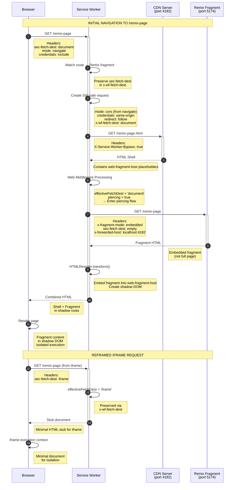
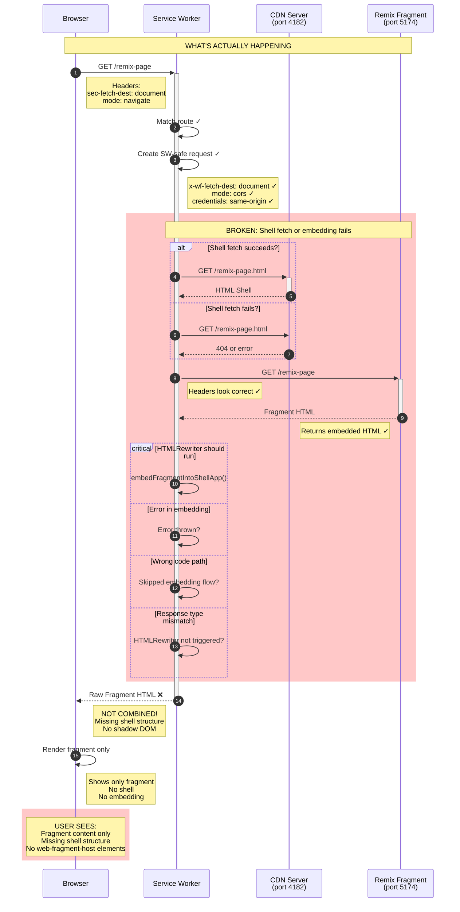
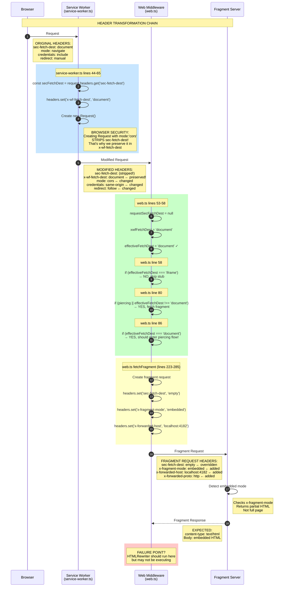
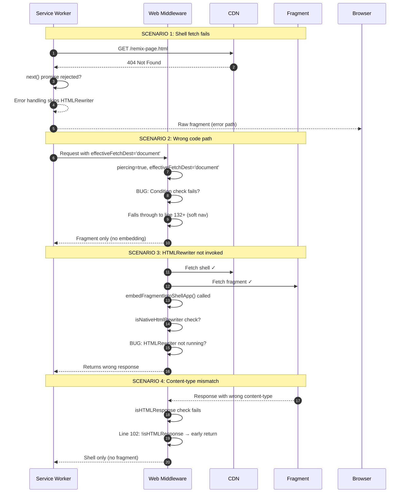

# Service Worker Fragment Gateway - Sequence Diagrams

## Expected Flow: Successful Fragment Piercing

## Current Broken Flow: Fragment Not Embedded

## Detailed Header Flow

## Possible Failure Scenarios

